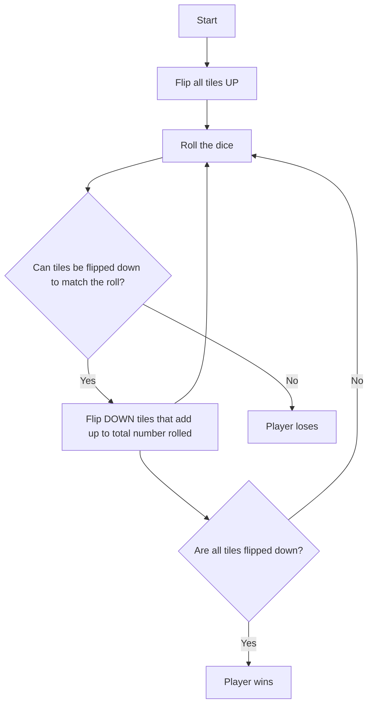
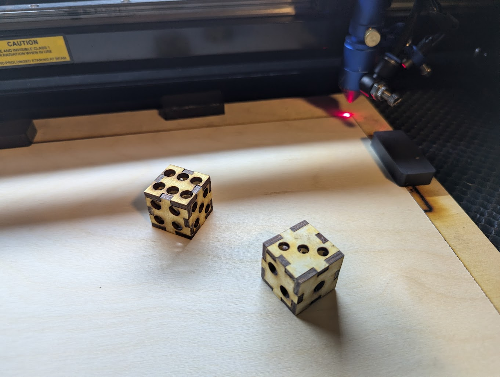

# Shut the Box


## How to play
1. Flip all the tiles UP
1. Roll the dice
1. Flip DOWN tiles that add up to total number rolled
1. Continue rolling until:
  * Last tiles flipped down, player wins
  * No combination can be flipped down, player loses




## Simulate the game and find optimal strategy
```
def main():
    '''
    Simulate a game of Shut the Box using different strategies and report the win rate.
    '''
    
    iterations = 100_000

    stratagies = [random_tiles, 
                  highest_tile, 
                  fewest_tiles, 
                  most_tiles, 
                  expirement, 
                  adaptive_strategy, 
                  prioritize_low_high]

    # Run the game for each strategy
    for stratagy in stratagies:
        print(f"stratagy: {stratagy.__name__}")

        wins = 0
        for i in range(iterations):
            wins += play(stratagy)

        # report strategy win rate  as a percentage
        print(f"Win Rate: {wins / iterations * 100:.2f}%")      

        # report stratey win rate as number of times you have to play to expect a win
        print(f"Win Rate: {1 / (wins / iterations):.0f} games\n")  
```

## Create a version of the game with a laser cutter


## Useful Links

Here are some useful links for creating a version of the game with a laser cutter and purchasing materials:

### Laser Cutter Box Designs from [Boxes.PY](https://boxes.hackerspace-bamberg.de/?language=en)
- [Top](https://boxes.hackerspace-bamberg.de/ABox?FingerJoint_style=rectangular&FingerJoint_surroundingspaces=2.0&FingerJoint_bottom_lip=0.0&FingerJoint_edge_width=1.0&FingerJoint_extra_length=0.0&FingerJoint_finger=2.0&FingerJoint_play=0.0&FingerJoint_space=2.0&FingerJoint_width=1.0&Lid_handle=none&Lid_style=none&Lid_handle_height=8.0&Lid_height=4.0&Lid_play=0.1&x=265&y=200&h=30&outside=0&outside=1&bottom_edge=h&thickness=3.0&format=svg&tabs=0.0&qr_code=0&debug=0&labels=0&labels=1&reference=100.0&inner_corners=loop&burn=0.1&language=en&render=0)
- [Bottom](https://boxes.hackerspace-bamberg.de/ABox?FingerJoint_style=rectangular&FingerJoint_surroundingspaces=2.0&FingerJoint_bottom_lip=0.0&FingerJoint_edge_width=1.0&FingerJoint_extra_length=0.0&FingerJoint_finger=2.0&FingerJoint_play=0.0&FingerJoint_space=2.0&FingerJoint_width=1.0&Lid_handle=none&Lid_style=none&Lid_handle_height=8.0&Lid_height=4.0&Lid_play=0.1&x=265&y=200&h=40&outside=0&outside=1&bottom_edge=h&thickness=3.0&format=svg&tabs=0.0&qr_code=0&debug=0&labels=0&labels=1&reference=100.0&inner_corners=loop&burn=0.1&language=en&render=0)
- [Top Anchor Insert](https://boxes.hackerspace-bamberg.de/ABox?FingerJoint_style=rectangular&FingerJoint_surroundingspaces=2.0&FingerJoint_bottom_lip=0.0&FingerJoint_edge_width=1.0&FingerJoint_extra_length=0.0&FingerJoint_finger=2.0&FingerJoint_play=0.0&FingerJoint_space=2.0&FingerJoint_width=1.0&Lid_handle=none&Lid_style=none&Lid_handle_height=8.0&Lid_height=4.0&Lid_play=0.1&x=262&y=197&h=28&outside=0&outside=1&bottom_edge=h&thickness=3.0&format=svg&tabs=0.0&qr_code=0&debug=0&labels=0&labels=1&reference=100.0&inner_corners=loop&burn=0.1&language=en&render=0)
- [Peg Holder insert](https://boxes.hackerspace-bamberg.de/ABox?FingerJoint_style=rectangular&FingerJoint_surroundingspaces=2.0&FingerJoint_bottom_lip=0.0&FingerJoint_edge_width=1.0&FingerJoint_extra_length=0.0&FingerJoint_finger=2.0&FingerJoint_play=0.0&FingerJoint_space=2.0&FingerJoint_width=1.0&Lid_handle=none&Lid_style=none&Lid_handle_height=8.0&Lid_height=4.0&Lid_play=0.1&x=262&y=55&h=30&outside=0&outside=1&bottom_edge=h&thickness=3.0&format=svg&tabs=0.0&qr_code=0&debug=0&labels=0&labels=1&reference=100.0&inner_corners=loop&burn=0.1&language=en&render=0)

### Purchase Materials
- [1/8" Baltic Birch Plywood Sheets](https://www.amazon.com/Premium-Baltic-Plywood-Sheets-Woodpeckers/dp/B07NWYZJ3M/ref=mp_s_a_1_1_sspa?crid=3PRF5KMGAN6WL&dib=eyJ2IjoiMSJ9.dP3lAm-3PhXd7Ydx6-kmb5gkpGDtaBlGvuYW4Ta5LzP_7ZLfHRXgDKbXuKIqnLqitCLjtb-yT7-ByFSqQeClRdbf3sK5tyIeIZmT_g6hzp-mhZvHpSDf7pHOqzWqaiypANbale2Tg5JVVJBTrS6eCCVlFn2luo8gr_6fP8vOKfgHRxodXOIWpMhE0QztM04h2JgdbLLFA9uBAMrhVXHfvQ.uPxLmHTHmQmJC-pTKVnwUSlOfE3Sz7-blfA5uzxFA5w&dib_tag=se&keywords=1%2F8%2Bbaltic%2Bbirch%2Bplywood%2B12x20&qid=1730488850&sprefix=1%2F8%2Bbal%2Caps%2C109&sr=8-1-spons&sp_csd=d2lkZ2V0TmFtZT1zcF9waG9uZV9zZWFyY2hfYXRm&th=1)

## First Pancake


### Notes after playing with v1.0
1. Lots of fine tuning on laser cutter config stuff like kerfs. Not sure if these should be put into the design or kept in configs to handle different material
1. Lid is WAY to tall. Could be 10mm (vs. 40mm .) This might add strain on the hunge when it's open on a flat surface though. Consider hinge placement to support opening more than 180d to prevent hinge stress.
1. Spacers are key to keeping things from rubbing. [Tile box with additional supports needs](images/intra-tile-supports.png) tiles to be just a smidge narrower so 2 more spaces can fir next to the supports
1. Rob holding supports can be smaller/less material. Add more trimming/rounding on upper front corner.
1. Fill in the numbers
1. Random frog behind the 9 tile was an awesomely awesome accident
1. Plex lid needs the supports, just glue is very prone to seperation on box shut. Doesn't need all four - but some way to anchor it vertically is needed if not using glue
1. Tile holder should be taller so the back pieces are flush with the top of the bottom box. Original has this, makes tile "grabbing" cleaner
1. Overall fit - tight fit makes it difficult to glue with hot glue. Maybe with wood glue this isn't a problem
1. Tile holder is too long. The "resting" piece in the front could be moved back quite a bit.
1. Lots of design elements burn through to the other side
1. Tile width - as above, get width right. Should fit 12 spacers + 2 supports
1. Tile height - had to sand a couple to get them to flip w/o scraping the bottom. Lowering the grove would help. I like the height now. Feels right
1. Flair: Leaves on corners is good but could be better.

## Dice


## Teaching ChatGPT to play
[Full ChatGPT Session](https://chatgpt.com/share/67279330-a8f8-8009-9172-d0ac83a69630)
### tl;dr;
```
Initial Findings

The tree is already revealing that closing fewer tiles with each roll seems to increase the probability of reaching a winning state in many configurations. However, the model is still running for more exhaustive coverage.
```