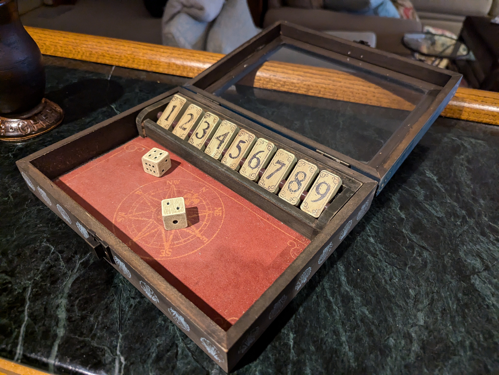
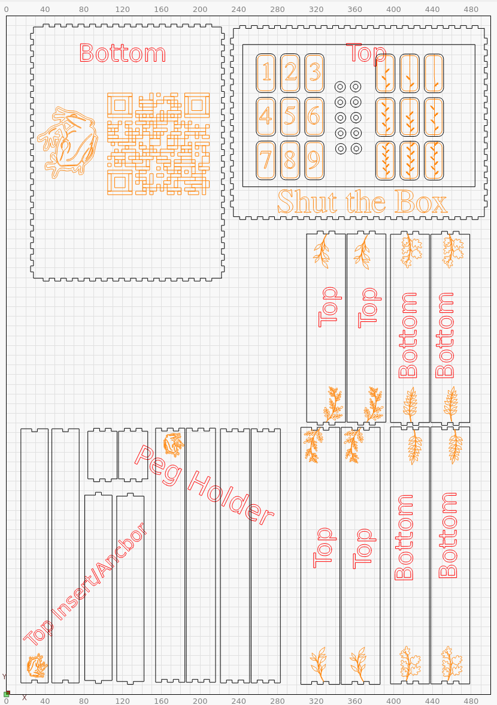

# Shut the Box



## Simulate the game and find optimal strategy
```
def main():
    '''
    Simulate a game of Shut the Box using different strategies and report the win rate.
    '''
    
    iterations = 100_000

    stratagies = [random_tiles, 
                  highest_tile, 
                  fewest_tiles, 
                  most_tiles, 
                  expirement, 
                  adaptive_strategy, 
                  prioritize_low_high]

    # Run the game for each strategy
    for stratagy in stratagies:
        print(f"stratagy: {stratagy.__name__}")

        wins = 0
        for i in range(iterations):
            wins += play(stratagy)

        # report strategy win rate  as a percentage
        print(f"Win Rate: {wins / iterations * 100:.2f}%")      

        # report stratey win rate as number of times you have to play to expect a win
        print(f"Win Rate: {1 / (wins / iterations):.0f} games\n")  
```

## Create a version of the game with a laser cutter



